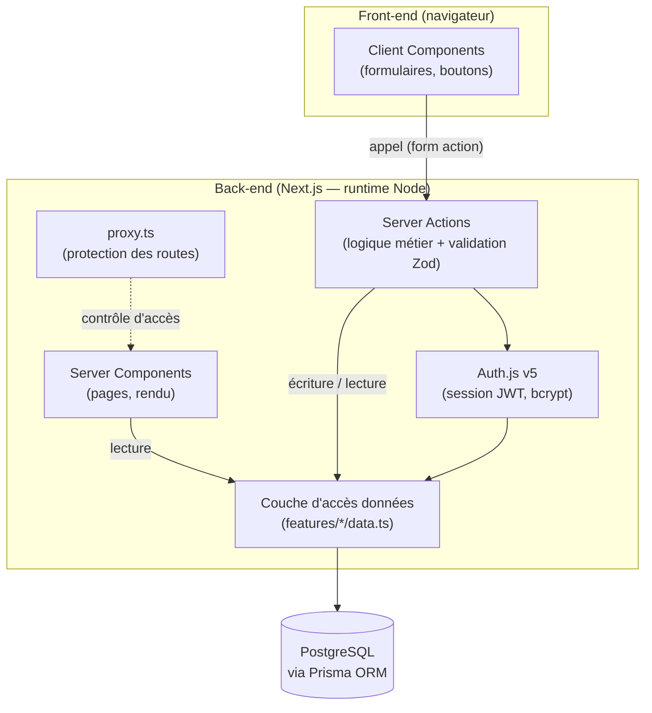
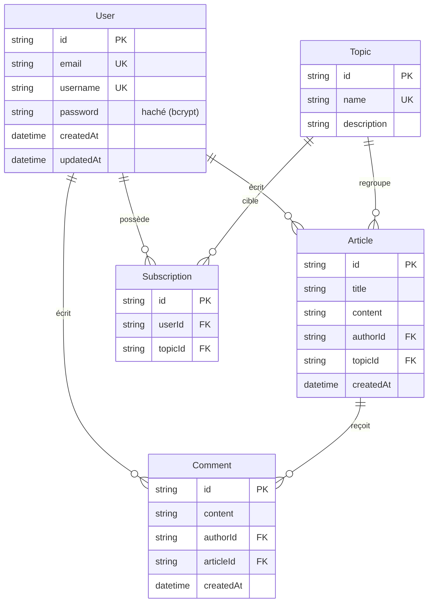

Auteur : Fitzjean Maxime

Version : 1.0.0

Date : 08/09/2026

# **Documentation et rapport du projet MDD**

> Projet P5 OpenClassrooms — parcours *Développeur Full-Stack JavaScript* —
> réalisé en **Option B** (scénario fictif de l'entreprise **ORION**).
> Dépôt : https://github.com/Innozenz/mdd

## **Sommaire**

1. Présentation générale du projet
   1.1 Objectifs du projet
   1.2 Périmètre fonctionnel
2. Architecture et conception technique
   2.1 Schéma global de l'architecture
   2.2 Choix techniques
   2.3 API (Server Actions) et schémas de données
3. Tests, performance et qualité
   3.1 Stratégie de test
   3.2 Rapport de performance et optimisation
   3.3 Revue technique
4. Documentation utilisateur et supervision
   4.1 FAQ utilisateur
   4.2 Supervision et tâches déléguées à l'IA
5. **Annexes**

---

## **1. Présentation générale du projet**

### **1.1 Objectifs du projet**

**MDD (Monde de Dév)** est un réseau social destiné aux développeurs. Il leur
permet de **s'abonner à des thèmes** de programmation (JavaScript, TypeScript,
Python, DevOps…), de **publier des articles**, de **commenter** ceux des autres
et de suivre un **fil d'actualité chronologique** alimenté par leurs
abonnements.

L'entreprise fictive **ORION** souhaite valider le concept auprès d'un public
interne à travers un **MVP (Minimum Viable Product)** avant un lancement plus
large. Le produit doit donc rester **volontairement simple** : pas de
back-office, pas de fonctionnalités hors périmètre. La valeur attendue est de
créer un vivier de mise en relation et de collaboration entre pairs, qui
pourrait devenir un canal de recrutement.

### **1.2 Périmètre fonctionnel**

Toutes les fonctionnalités des spécifications sont **livrées**.

| Fonctionnalités | Description | Statut |
| :---- | :---- | :---- |
| **Inscription** | Création de compte (nom d'utilisateur + e-mail + mot de passe), validation Zod, connexion automatique | ✅ Terminée |
| **Connexion / déconnexion** | Connexion par e-mail **ou** nom d'utilisateur ; session persistante entre sessions | ✅ Terminée |
| **Profil** | Consultation et modification (e-mail, nom d'utilisateur, mot de passe) | ✅ Terminée |
| **Liste des thèmes** | Page dédiée listant **tous** les thèmes (abonné ou non) | ✅ Terminée |
| **Abonnements** | S'abonner depuis la page Thèmes (bouton → « Déjà abonné ») ; se désabonner depuis le profil | ✅ Terminée |
| **Fil d'actualité** | Articles des thèmes abonnés, tri chronologique **récent ↔ ancien** | ✅ Terminée |
| **Publication d'un article** | Choix du thème + titre + contenu ; auteur et date automatiques | ✅ Terminée |
| **Consultation d'un article** | Thème, titre, auteur, date, contenu, commentaires | ✅ Terminée |
| **Commentaires** | Ajout d'un commentaire (non récursif) ; auteur et date automatiques | ✅ Terminée |
| **Responsive & accessibilité** | Mobile + desktop, ARIA, navigation clavier, contrastes | ✅ Terminée |

**Règle du mot de passe** (implémentée et testée) : ≥ 8 caractères **et** au
moins une minuscule, une majuscule, un chiffre et un caractère spécial.

---

## **2. Architecture et conception technique**

### **2.1 Schéma global de l'architecture**

L'application est une **application Next.js full-stack** (App Router). La
« distinction front / back » exigée par ORION est réalisée de façon **logique** :
les composants d'interface (Client & Server Components) sont séparés de la
**logique métier** (Server Actions) et de la **couche d'accès aux données**
(Prisma), elle-même seule à dialoguer avec PostgreSQL. La communication
front → back passe par les **Server Actions** (l'« API » du projet), sécurisées
par Auth.js.



**Organisation du code — architecture *feature-based*** :

```
app/
  (auth)/           # login, register (pages publiques)
  (app)/            # routes authentifiées + en-tête partagé (layout)
    feed, themes, articles/[id], articles/new, profile
  api/auth/[...nextauth]/   # handler Auth.js
  page.tsx, error.tsx, not-found.tsx, layout.tsx
features/           # 1 dossier par domaine métier
  auth/  topics/  subscriptions/  articles/  comments/  profile/
    data.ts         # accès Prisma (couche « repository »)
    actions.ts      # Server Actions ("use server")
    components/     # composants UI du domaine
lib/
  prisma.ts         # client Prisma (singleton)
  definitions/      # schémas Zod centralisés (auth, article, comment, profile)
  format.ts, utils.ts
components/         # UI transverse (mdd-logo, app-header, ui/ shadcn)
auth.ts, auth.config.ts, proxy.ts   # configuration Auth.js & protection
prisma/             # schema.prisma, migrations, seed
```

Chaque domaine est **autonome et modulaire** (séparation des responsabilités,
principes SOLID). La couche `data.ts` isole Prisma : les Server Actions et les
Server Components ne manipulent jamais l'ORM directement.

### **2.2 Choix techniques**

| Éléments choisis | Type | Lien documentation | Objectif du choix | Justification |
| :---- | :---- | :---- | :---- | :---- |
| **Next.js 16 (App Router)** | Framework full-stack | [nextjs.org](https://nextjs.org) | Architecture unifiée, Server Components & Server Actions | Imposé par ORION ; stack unique, typée de bout en bout, pas d'API REST séparée |
| **TypeScript 5** | Langage | [typescriptlang.org](https://www.typescriptlang.org) | Typage statique | Imposé ; fiabilité et documentation du code |
| **Prisma 6** | ORM | [prisma.io](https://www.prisma.io) | Accès BD typé, migrations | Imposé (pas de SQL brut) ; migrations versionnées |
| **PostgreSQL 17** | Base de données | [postgresql.org](https://www.postgresql.org) | Stockage relationnel | Imposé ; relations et contraintes fortes |
| **Auth.js v5 (Credentials + JWT)** | Authentification | [authjs.dev](https://authjs.dev) | Sécuriser l'accès | Recommandé pour Next.js ; session persistante, couvre les failles courantes |
| **bcryptjs** | Hachage | [npm](https://www.npmjs.com/package/bcryptjs) | Hacher les mots de passe | Pur JS (pas de toolchain native Windows), API identique à bcrypt |
| **Zod** | Validation | [zod.dev](https://zod.dev) | Valider les entrées | Schémas centralisés (`lib/definitions`), partagés client/serveur, remplacent les DTO |
| **Server Actions** | « API » | [docs](https://nextjs.org/docs/app/building-your-application/data-fetching/server-actions-and-mutations) | Communication front/back | Imposé App Router ; typé, sans endpoint REST à maintenir |
| **Tailwind CSS 4 + shadcn/ui** | UI | [ui.shadcn.com](https://ui.shadcn.com) | Composants accessibles | Cohérence visuelle, accessibilité, rapidité |
| **Vitest** | Tests unitaires | [vitest.dev](https://vitest.dev) | Tester la logique | Rapide, compatible ESM/TS |
| **Playwright** | Tests e2e | [playwright.dev](https://playwright.dev) | Tester les parcours | Recommandé ; navigateur réel |

> **Écarts assumés** (à mentionner en soutenance) : **Node 24** (LTS active) au
> lieu de Node 22 imposé ; **PostgreSQL sur le port 5433** en local (le 5432
> était occupé) ; **bcryptjs** plutôt que `bcrypt` natif.

### **2.3 API (Server Actions) et schémas de données**

Les Server Actions constituent l'API du projet. L'auteur et les dates sont
toujours déterminés **côté serveur** (jamais depuis le client). Toutes les
entrées sont validées par Zod avant tout accès aux données.

| Server Action / Endpoint | Type | Description | Retour / Réponse |
| :---- | :---- | :---- | :---- |
| `registerAction` | Mutation | Inscrit un utilisateur puis le connecte | Redirection `/feed` ou état d'erreur |
| `loginAction` | Mutation | Connexion par e-mail **ou** nom d'utilisateur | Redirection `/feed` ou message générique |
| `logoutAction` | Mutation | Déconnexion | Redirection `/` |
| `getTopics` | Query | Liste tous les thèmes (tri par nom) | `Topic[]` |
| `subscribeAction` | Mutation | Abonne l'utilisateur connecté à un thème | `void` (revalidation) |
| `unsubscribeAction` | Mutation | Désabonne l'utilisateur d'un thème | `void` (revalidation) |
| `getFeedArticles` | Query | Fil des thèmes abonnés, trié | `FeedArticle[]` |
| `getArticleById` | Query | Détail d'un article (auteur, thème) | `ArticleDetail \| null` |
| `createArticleAction` | Mutation | Crée un article (thème, titre, contenu) | Redirection `/articles/[id]` |
| `getCommentsByArticle` | Query | Commentaires d'un article | `Comment[]` |
| `addCommentAction` | Mutation | Ajoute un commentaire | `null` (succès) ou état d'erreur |
| `getUserProfile` | Query | Profil (sans mot de passe) | `UserProfile \| null` |
| `updateProfileAction` | Mutation | Met à jour e-mail / nom / mot de passe | État `success` ou erreurs |
| `handlers` (GET/POST) | Route Handler | Endpoints Auth.js (`/api/auth/*`) | Session / cookie |

**Schéma de données (Prisma / ERD)** — 5 modèles :



Contraintes clés : unicité sur `User.email`, `User.username`, `Topic.name` et
sur le couple `Subscription(userId, topicId)` ; index sur les clés étrangères et
`Article.createdAt` ; suppressions en **cascade** (RGPD : la suppression d'un
utilisateur retire ses articles, commentaires et abonnements).

---

## **3. Tests, performance et qualité**

### **3.1 Stratégie de test**

Deux niveaux : **unitaires** (logique métier — le « back ») avec Vitest, et
**end-to-end** (parcours utilisateur — le « front ») avec Playwright. Pattern
**Arrange-Act-Assert** systématique.

| Type de test | Outil / framework | Portée | Résultats |
| :---- | :---- | :---- | :---- |
| Unitaire | Vitest | Schémas Zod, Server Actions, couche data, utilitaires | **67 tests ✅** |
| End-to-end | Playwright | Inscription, connexion, route protégée, abonnement, article, commentaire, fil | **6 tests ✅** |

**Couverture (Vitest, `npm run test:cov`)** — seuil du projet ~70 % **dépassé** :

| Métrique | Couverture |
| :---- | :---- |
| Lignes | **94,5 %** |
| Instructions | **94,6 %** |
| Fonctions | **92,3 %** |
| Branches | **73,8 %** |

Commandes : `npm test` (unitaires), `npm run test:cov` (couverture),
`npm run test:e2e` (end-to-end).

### **3.2 Rapport de performance et optimisation**

Optimisations appliquées :

* **Server Components par défaut** : les pages (fil, thèmes, article, profil)
  sont rendues côté serveur ; le JavaScript client est limité aux formulaires
  et boutons interactifs → charge réduite côté navigateur.
* **Requêtes parallèles** : `Promise.all` pour charger en une passe les données
  indépendantes (ex. thèmes + abonnements sur la page Thèmes).
* **Requêtes optimisées Prisma** : `select` restreint (le mot de passe n'est
  jamais chargé pour l'affichage), `_count` pour le nombre de commentaires
  (évite un chargement complet), **index** sur les colonnes filtrées/triées.
* **Idempotence** : abonnement via `upsert` (pas de doublon possible).
* **Revalidation ciblée** : `revalidatePath` sur les seules pages concernées
  après une mutation.

Points de mesure possibles à approfondir : audit Lighthouse, `next build`
(taille des bundles). Aucune requête N+1 détectée (les relations sont chargées
via `include`).

### **3.3 Revue technique**

**Points forts**

* Typage strict de bout en bout (TypeScript + Prisma + Zod), 0 erreur `tsc`.
* Architecture *feature-based* claire ; couche d'accès aux données isolée.
* Sécurité : mots de passe hachés (jamais renvoyés), validation systématique
  côté serveur, messages d'erreur sans fuite d'information, en-têtes HTTP de
  sécurité, protection des routes.
* Couverture de tests élevée (94 % lignes) + e2e sur les parcours critiques.

**Points à améliorer / dette technique**

* Le nom d'utilisateur affiché dans l'en-tête provient du jeton de session : il
  n'est rafraîchi qu'à la reconnexion après modification du profil.
* Pas de pagination du fil (acceptable pour un MVP ; à prévoir à l'échelle).
* CSP stricte non mise en place (nécessite des nonces ; hors périmètre MVP).

**Actions correctives déjà appliquées**

* **Duplication de validation** → centralisation des schémas Zod dans
  `lib/definitions`.
* **Migration Next.js 16** : `middleware.ts` remplacé par `proxy.ts` (nouvelle
  convention) après détection à l'exécution.
* **Migrations Prisma** : retirées du `.gitignore` du starter pour être
  versionnées (reproductibilité de la base).

---

## **4. Documentation utilisateur et supervision**

### **4.1 FAQ utilisateur**

**Q : Comment créer un compte ?**
R : Sur la page d'accueil, cliquez sur « S'inscrire », renseignez un nom
d'utilisateur, un e-mail et un mot de passe, puis validez. Vous êtes
automatiquement connecté.

**Q : Quelles sont les règles pour le mot de passe ?**
R : Au moins 8 caractères, avec au minimum une minuscule, une majuscule, un
chiffre et un caractère spécial.

**Q : Puis-je me connecter avec mon nom d'utilisateur ?**
R : Oui. Le champ de connexion accepte votre e-mail **ou** votre nom
d'utilisateur, avec votre mot de passe.

**Q : Comment voir des articles dans mon fil ?**
R : Abonnez-vous à des thèmes depuis la page « Thèmes ». Votre fil affiche
ensuite les articles de ces thèmes, du plus récent au plus ancien (le sens de
tri est réglable).

**Q : Comment publier un article ?**
R : Depuis le fil, cliquez sur « Créer un article », choisissez un thème,
saisissez un titre et un contenu, puis validez. L'auteur et la date sont
ajoutés automatiquement.

**Q : Comment me désabonner d'un thème ?**
R : Rendez-vous sur votre profil, section « Abonnements », puis cliquez sur
« Se désabonner » sur le thème concerné.

**Q : Mes données sont-elles protégées ?**
R : Votre mot de passe est stocké **haché** (jamais en clair) et n'est jamais
renvoyé à votre navigateur. Les accès sont protégés par authentification. La
suppression d'un compte entraîne la suppression de ses articles, commentaires
et abonnements (conformité RGPD).

**Q : L'application ne se charge pas, que faire ?**
R : Rafraîchissez la page. Si le problème persiste, vérifiez votre connexion
puis contactez le support technique.

### **4.2 Supervision et tâches déléguées à l'IA**

Conformément à la posture de supervision attendue, plusieurs tâches ont été
**déléguées à l'IA** (assistant de code) puis **relues, testées et validées**.

| Tâche déléguée | Outil | Objectif | Vérification effectuée |
| :---- | :---- | :---- | :---- |
| Schéma Prisma + seed | Assistant IA | Modéliser les 5 entités et peupler des données de test | Relecture des relations/contraintes, migration appliquée, requêtes de contrôle en base |
| Schémas de validation Zod | Assistant IA | Centraliser les règles (dont mot de passe) | Tests unitaires des 4 règles et des cas limites |
| Configuration Auth.js + Server Actions | Assistant IA | Authentification et logique métier | Parcours complet testé au navigateur, `tsc` + linter |
| Fonctionnalités MVP (abonnements, articles, commentaires, profil) | Assistant IA | Implémentation guidée par les specs | Tests navigateur + contrôles en base (auteur/date auto, unicité, hachage) |
| Intégration des maquettes | Assistant IA | Habillage conforme à Figma | Comparaison écran par écran dans le navigateur |
| Tests unitaires et e2e | Assistant IA | Couverture ~70 % + parcours | Exécution complète, correction des échecs, contrôle de la couverture |

Le détail chronologique de cette supervision (ce qui a été demandé, produit,
vérifié) est consigné dans le **journal de bord** du projet (voir Annexes).

---

## **5. Annexes**

* **Captures d'écran de l'UI** : accueil, connexion, inscription, fil, article
  (+ commentaires), thèmes, création d'article, profil. *(à insérer)*
* **Analyse des besoins front-end** : voir §1.2 et la conformité aux maquettes
  Figma (§2, étape d'intégration).
* **Définition des données** : schéma Prisma (`prisma/schema.prisma`), ERD
  (§2.3), schémas Zod (`lib/definitions`).
* **Rapports de couverture et de tests** : `npm run test:cov` (résumé §3.1 ;
  rapport HTML dans `coverage/`), `npm run test:e2e` (6 tests).
* **Rapport de revue technique** : §3.3.
* **Journal de bord (présentation incrémentale du projet, supervision IA)** :
  document vivant complété à chaque étape.
